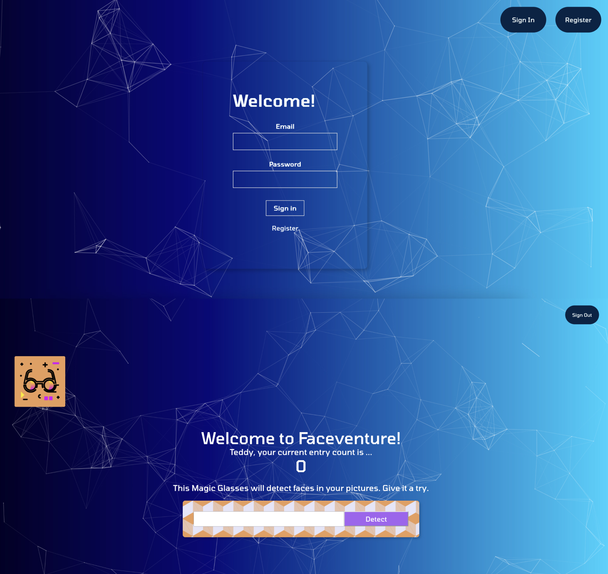

# Faceventure (Face Recognition Brain) 

## Overview
This project uses an API that requires the user to detect faces on images. It only reads on jpeg format and shows the number of entries. New users require to register and sign in.

## Technology used

- React
- HTML5
- CSS3
- Tachyons
- Clarifai API
- SQL

## Screenshot


## Install locally

```
// In the terminal, run the following commands:

npm install
npm start

```

[Backend Server](https://github.com/RioCantre/smart-brain-api)

## Credits
[The Complete Web Developer in 2022: Zero to Mastery](https://academy.zerotomastery.io/p/complete-web-developer-zero-to-mastery)

<hr>

### ✨ [Portfolio Preview](https://github.com/RioCantre/rioc-portfolio/blob/main/README.md) 


